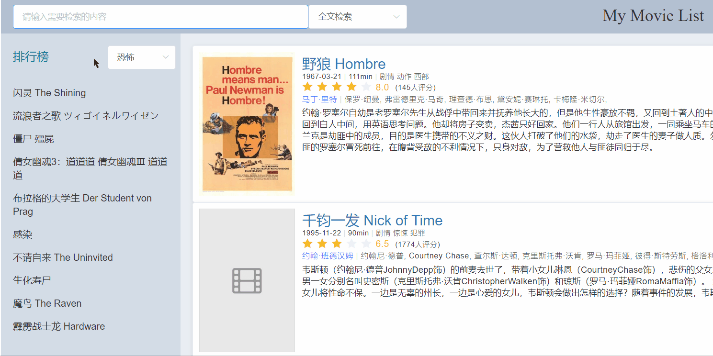
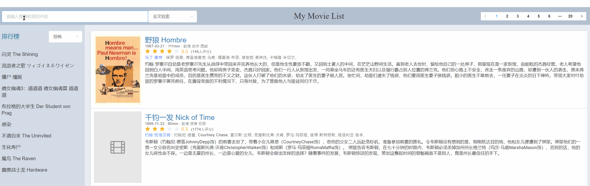
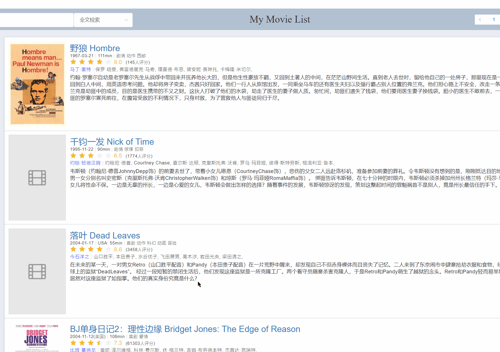

# My-Movie-List
同济大学软件学院2019年网页开发课程第二次作业展示

1551719 张文喆

## Build Setup

```bash
# install dependencies
npm install

# serve with hot reload at localhost:8080
npm run dev

# build for production with minification
npm run build

# build for production and view the bundle analyzer report
npm run build --report
```

For a detailed explanation on how things work, check out the [guide](http://vuejs-templates.github.io/webpack/) and [docs for vue-loader](http://vuejs.github.io/vue-loader).

## 1. 功能

### 基础功能

1. 读取JSON文件并渲染数据
2. 电影列表展示
3. 分页

### 附加功能

1. 按多种类型搜索
2. 电影详情页
3. 排行榜（按类型分榜/总榜）
4. 无法显示的海报图片自动替换
5. 可爱的favicon，见标签页左上角

## 2. 项目展示

访问链接：https://pancerzh.github.io/My-Movie-List/#/movie-list

##### 搜索功能



##### 排行榜


##### 分页条



##### 详情页

